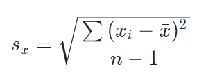

# Standard Deviation

Standard deviation measures the spread of a data distribution. It measures the typical distance between each data point and the mean.

The formula we use for standard deviation depends on whether the data is being considered a population of its own, or the data is a sample representing a larger population.
- If the data is being considered a population on its own, we divide by the number of data points, N.
- If the data is a sample from a larger population, we divide by one fewer than the number of data points in the sample, n-1 

1. Population standard deviation:  

2. Sample standard deviation:  

